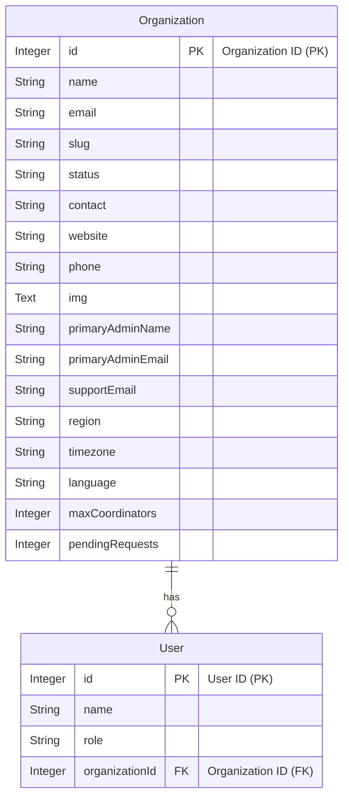

# 👋 Hi, I'm Krishna Kanth !

I'm a passionate **B.Tech student**, aspiring **Full Stack Web Developer**, and a problem-solver who loves to explore technology and write clean, efficient code. With a strong foundation in **Data Structures and Algorithms**, I aim to create impactful projects and share knowledge within the tech community.

*Thank you for visiting my GitHub profile! Feel free to explore my repositories and connect with me!* 🚀
## Database Schema (ER Diagram)

